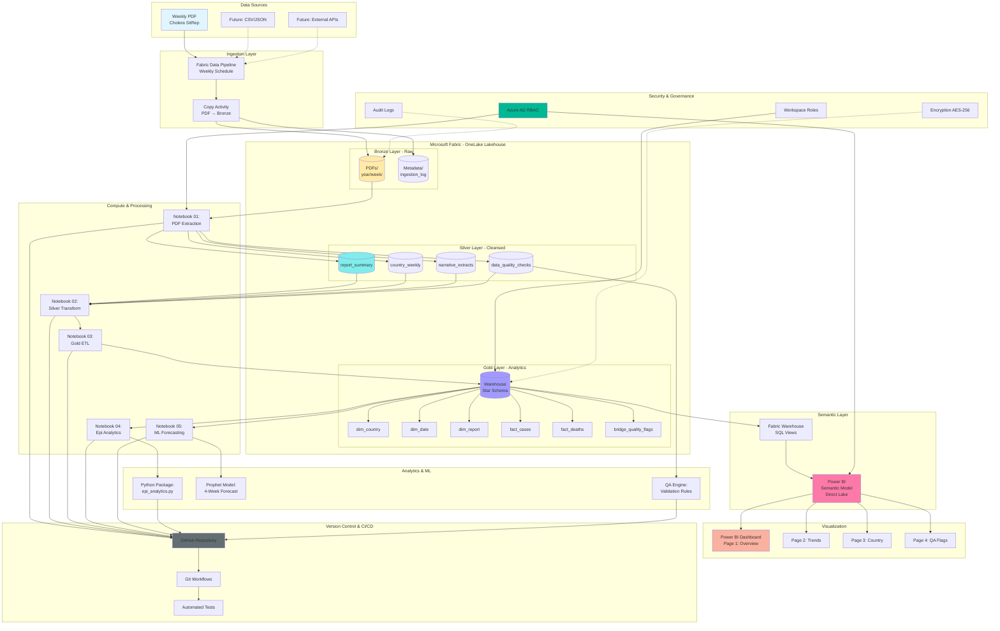

# CENTRAL DATA REPOSITORY (CDR) MVP: Cholera Surveillance System
## Africa CDC - Microsoft Fabric Implementation Guide

---

## 1. MVP BLUEPRINT

### 1.1 MVP Scope & Boundaries

**IN SCOPE:**
- Weekly cholera surveillance data ingestion from PDF reports
- Automated PDF extraction pipeline (KPI panel, narratives, epi-week updates, country breakdowns)
- Bronze/Silver/Gold medallion architecture in OneLake Lakehouse
- Dimensional data model (star schema) for epidemiological analytics
- Python-based data engineering + epidemiological calculations (incidence, CFR, growth rates, moving averages)
- One ML component: time-series forecasting (Prophet/SARIMA) for case prediction
- Quality assurance layer with reconciliation rules (KPI vs narrative validation)
- Power BI semantic model + 4 dashboard pages (Overview, Trends, Country Breakdown, QA Flags)
- RBAC and workspace separation (dev/test/prod environments)
- GitHub repository with CI/CD fundamentals
- Sample data: publicly available WHO/Africa CDC cholera reports (aggregate, no PII)

**OUT OF SCOPE (Future Phases):**
- Real-time streaming data ingestion
- Personal identifiable information (PII) handling
- Integration with external APIs (DHIS2, OpenHIE, SORMAS)
- Multi-disease surveillance (focus: cholera only)
- Advanced ML models (deep learning, graph analytics)
- Mobile data collection apps
- Blockchain/distributed ledger for data provenance

**SUCCESS CRITERIA:**
1. PDF ingested weekly → structured tables in <8 hours (automated)
2. Data quality checks flag discrepancies (>95% accuracy vs manual extraction)
3. Power BI dashboard refreshes successfully with latest data
4. End-to-end pipeline executable by non-technical user (documented runbook)
5. Repository deployable to new Fabric workspace in <4 hours

**ASSUMPTIONS:**
- PDF format remains consistent (KPI panel + narrative structure)
- Weekly reports published Fridays; pipeline runs Saturdays 6 AM UTC
- No OCR required (PDFs are text-selectable)
- Fabric capacity provisioned (F64 or higher recommended)
- Power BI Pro licenses available for developers; Premium for stakeholders
- Azure AD groups configured for RBAC
- Synthetic data used for testing; real data governed by Africa CDC data sharing agreements

---

### 1.2 Target Architecture: Microsoft Fabric

#### **Federated Architecture Approach (MVP + Future State)**

**MVP Implementation:**
- Single Fabric workspace represents Africa CDC central node
- OneLake serves as federated data lake (can mount external shortcuts later)
- Data sovereignty: All data resides in Africa CDC tenant; future federated queries via shortcuts

**Future Federated State:**
- Member State workspaces connect via OneLake shortcuts (read-only federation)
- Each Member State maintains sovereignty; Africa CDC aggregates via cross-workspace queries
- Delta sharing protocols for secure, auditable data exchange

#### **Ingestion Layer**

```
Weekly PDF Reports (SharePoint/OneDrive/Local Upload)
    ↓
Fabric Data Pipeline (Copy Activity + Notebook trigger)
    ↓
OneLake Bronze Layer (Raw PDFs + extraction timestamp metadata)
```

**Components:**
- **Data Pipeline**: Scheduled weekly (Saturday 6 AM UTC)
  - Copy Activity: Moves PDF from source (SharePoint folder) to Bronze
  - Notebook Activity: Triggers PDF extraction notebook
  - Success/Failure notifications via email (Fabric monitoring)

#### **Bronze Layer (Raw Landing Zone)**

```
lakehouse_cholera_cdr/
  Files/
    bronze/
      pdfs/
        cholera_sitrep_2025_wk06.pdf
        cholera_sitrep_2025_wk07.pdf
      metadata/
        ingestion_log.json
```

**Characteristics:**
- Append-only (never delete, immutability for audit)
- Files partitioned by year/week (`pdfs/{year}/wk{week}/`)
- Metadata: source URL, ingestion timestamp, file hash, validator ID

#### **Silver Layer (Cleansed & Conformed)**

```
lakehouse_cholera_cdr/
  Tables/
    silver/
      report_summary        # One row per report (KPI panel extracted)
      country_weekly        # Granular country-level data per epi-week
      narrative_extracts    # Free-text narratives with entity recognition
      data_quality_checks   # Validation flags (mismatches, anomalies)
```

**Silver Tables Schema:**

**`silver.report_summary`**
```
report_id (STRING, PK)
report_date (DATE)
epi_year (INT)
epi_week (INT)
confirmed_cases (INT)
suspected_cases (INT)
deaths (INT)
cfr_percent (DECIMAL)
affected_countries (INT)
first_reported_date (DATE)
risk_assessment (STRING)
data_source (STRING)
ingested_at (TIMESTAMP)
quality_flag (STRING)  # 'PASS', 'WARNING', 'FAIL'
```

**`silver.country_weekly`**
```
country_weekly_id (STRING, PK)
report_id (STRING, FK)
country_name (STRING)
epi_year (INT)
epi_week (INT)
new_cases (INT)
cumulative_cases (INT)
new_deaths (INT)
cumulative_deaths (INT)
cfr_percent (DECIMAL)
provinces_affected (INT)
data_source (STRING)
ingested_at (TIMESTAMP)
```

**`silver.narrative_extracts`**
```
narrative_id (STRING, PK)
report_id (STRING, FK)
narrative_type (STRING)  # 'update_to_event', 'epi_week_summary', 'country_detail'
narrative_text (STRING)
extracted_entities (JSON)  # Countries, numbers, dates
ingested_at (TIMESTAMP)
```

**`silver.data_quality_checks`**
```
check_id (STRING, PK)
report_id (STRING, FK)
check_type (STRING)  # 'CFR_MISMATCH', 'CASE_SUM_MISMATCH', 'MISSING_COUNTRY'
severity (STRING)  # 'ERROR', 'WARNING', 'INFO'
expected_value (STRING)
actual_value (STRING)
check_timestamp (TIMESTAMP)
```

**Transformation Rules:**
- CFR calculated: `(deaths / confirmed_cases) * 100` → compare with PDF stated CFR
- Country name standardization (ISO 3166-1 alpha-3 codes mapping)
- Date parsing: Handle multiple formats (DD-MMM-YYYY, YYYY-MM-DD)
- Deduplication: Reject if `report_id` exists (idempotency)
- Schema validation: Enforce NOT NULL on critical fields

#### **Gold Layer (Analytics-Ready)**

```
warehouse_cholera_analytics/
  Schemas/
    gold/
      dim_country
      dim_date
      dim_report
      fact_cholera_cases
      fact_cholera_deaths
      bridge_quality_flags
```

**Star Schema Design:**

**Dimension: `dim_country`**
```
country_key (INT, PK, surrogate)
country_code (STRING, ISO 3166-1 alpha-3)
country_name (STRING)
who_region (STRING)
au_region (STRING)  # East, West, Central, Southern, North
population (BIGINT)
is_current (BOOLEAN)  # SCD Type 2 support
valid_from (DATE)
valid_to (DATE)
```

**Dimension: `dim_date`**
```
date_key (INT, PK, YYYYMMDD format)
date (DATE)
epi_year (INT)
epi_week (INT)
calendar_year (INT)
calendar_quarter (INT)
calendar_month (INT)
day_of_week (STRING)
is_weekend (BOOLEAN)
```

**Dimension: `dim_report`**
```
report_key (INT, PK, surrogate)
report_id (STRING, natural key)
report_date (DATE)
report_type (STRING)  # 'Weekly', 'Outbreak', 'Ad-hoc'
data_source (STRING)
quality_score (DECIMAL)  # 0-100 composite score
```

**Fact: `fact_cholera_cases`**
```
case_key (BIGINT, PK, surrogate)
report_key (INT, FK)
country_key (INT, FK)
date_key (INT, FK)
new_cases (INT)
cumulative_cases (INT)
confirmed_cases (INT)
suspected_cases (INT)
attack_rate (DECIMAL)  # Cases per 100,000 population
```

**Fact: `fact_cholera_deaths`**
```
death_key (BIGINT, PK, surrogate)
report_key (INT, FK)
country_key (INT, FK)
date_key (INT, FK)
new_deaths (INT)
cumulative_deaths (INT)
cfr_percent (DECIMAL)
```

**Bridge: `bridge_quality_flags`**
```
flag_key (INT, PK)
report_key (INT, FK)
flag_type (STRING)
severity (STRING)
flag_description (STRING)
resolved (BOOLEAN)
resolved_date (DATE)
```

#### **Compute & Processing**

**Fabric Notebooks:**
1. **`01_pdf_extraction.ipynb`**
   - Libraries: `pdfplumber`, `tabula-py`, `camelot-py`, `PyMuPDF`
   - Extracts structured/semi-structured data from PDFs
   - Outputs: JSON intermediate → Silver tables

2. **`02_silver_transformation.ipynb`**
   - Data cleansing (standardization, validation)
   - Quality checks execution
   - Writes to Silver Delta tables

3. **`03_gold_dimensional_model.ipynb`**
   - SCD Type 2 updates for dimensions
   - Fact table inserts (incremental)
   - Aggregations and derived metrics

4. **`04_epi_analytics.ipynb`**
   - Epidemiological calculations:
     - Incidence rate: `(new_cases / population) * 100,000`
     - Growth rate: `((current_week_cases - previous_week_cases) / previous_week_cases) * 100`
     - 4-week moving average
     - Case fatality rate trends
   - Statistical tests: Mann-Kendall trend test, change point detection

5. **`05_ml_forecasting.ipynb`**
   - Prophet model for 4-week ahead case forecasting
   - Feature engineering: lag variables, seasonality indicators
   - Model evaluation: RMSE, MAE, MAPE
   - Explainability: Feature importance, uncertainty intervals

**Semantic Layer:**
- Fabric Warehouse SQL views aggregating Gold tables
- Direct Lake mode for Power BI (no import, low latency)

#### **Security & Governance**

**Workspace Separation:**
- `cdr-cholera-dev` (Development)
- `cdr-cholera-test` (UAT/Testing)
- `cdr-cholera-prod` (Production)

**RBAC Matrix:**

| Role | Dev Workspace | Test Workspace | Prod Workspace | Permissions |
|------|--------------|----------------|----------------|-------------|
| Data Engineer | Admin | Contributor | Viewer | Develop pipelines, edit notebooks |
| Data Analyst | Contributor | Contributor | Viewer | Query data, edit reports |
| Epidemiologist | Viewer | Viewer | Viewer | Consume dashboards, export data |
| IT Admin | Admin | Admin | Admin | Full control, manage access |

**Encryption:**
- At-rest: Fabric/OneLake managed encryption (AES-256)
- In-transit: TLS 1.2+ enforced
- Document: Encryption status in `docs/security_compliance.md`

**Auditability:**
- Fabric Activity Log: All read/write operations
- Delta Lake transaction log: Time-travel queries
- Custom audit table: `audit.data_access_log` (user, timestamp, action, dataset)

**Backup & DR:**
- OneLake versioning: 30-day retention for Delta tables
- Weekly full backup to Azure Blob Storage (cold tier)
- RPO: 24 hours | RTO: 4 hours (restore from backup)
- DR plan: Cross-region workspace replication (future)

---

### 1.3 Data Dictionary & Naming Conventions

**Naming Conventions:**

**Lakehouse Tables:**
- Pattern: `{layer}_{entity}_{description}`
- Examples: `silver_report_summary`, `gold_fact_cases`
- Lowercase, snake_case

**Columns:**
- Descriptive, lowercase, snake_case
- Surrogate keys: `{entity}_key` (e.g., `country_key`)
- Foreign keys: Match parent key name
- Dates: `{event}_date` (e.g., `report_date`)
- Timestamps: `{event}_at` (e.g., `ingested_at`)

**Files:**
- PDFs: `cholera_sitrep_{YYYY}_wk{WW}.pdf` (ISO 8601 week)
- Notebooks: `{sequence}_{purpose}.ipynb` (e.g., `01_pdf_extraction.ipynb`)
- Scripts: `{verb}_{noun}.py` (e.g., `validate_schema.py`)

**Data Dictionary Template:**

| Table | Column | Data Type | Nullable | Description | Business Rules |
|-------|--------|-----------|----------|-------------|----------------|
| silver.report_summary | report_id | STRING | N | Unique identifier (YYYY_WK_HASH) | Generated from report_date + hash |
| silver.report_summary | cfr_percent | DECIMAL(5,2) | Y | Case Fatality Rate | (deaths/confirmed)*100, validated |
| gold.dim_country | country_code | STRING(3) | N | ISO 3166-1 alpha-3 | Lookup from reference table |

*(Full dictionary in repository: `docs/data_dictionary.xlsx`)*

---

### 1.4 Analytics Layer: Python Modules

**Epidemiological Metrics Module** (`src/epi_analytics.py`)

```python
def calculate_incidence_rate(cases: int, population: int, multiplier: int = 100000) -> float:
    """Calculate incidence rate per 100,000 population"""
    return (cases / population) * multiplier if population > 0 else 0.0

def calculate_cfr(deaths: int, confirmed_cases: int) -> float:
    """Case Fatality Rate as percentage"""
    return (deaths / confirmed_cases) * 100 if confirmed_cases > 0 else 0.0

def moving_average(series: pd.Series, window: int = 4) -> pd.Series:
    """Calculate rolling average for smoothing trends"""
    return series.rolling(window=window, min_periods=1).mean()

def growth_rate(current: int, previous: int) -> float:
    """Week-over-week growth rate percentage"""
    return ((current - previous) / previous) * 100 if previous > 0 else float('inf')

def detect_anomalies(series: pd.Series, threshold: float = 2.5) -> pd.Series:
    """Flag outliers using modified z-score (MAD-based)"""
    median = series.median()
    mad = (series - median).abs().median()
    modified_z = 0.6745 * (series - median) / mad if mad != 0 else 0
    return abs(modified_z) > threshold
```

**ML Forecasting Module** (`src/ml_forecasting.py`)

```python
from prophet import Prophet
import pandas as pd

def train_prophet_model(df: pd.DataFrame, forecast_weeks: int = 4) -> tuple:
    """
    Train Prophet model for case forecasting
    Args:
        df: DataFrame with 'ds' (date) and 'y' (cases) columns
        forecast_weeks: Number of weeks to predict
    Returns:
        (model, forecast_df, metrics)
    """
    model = Prophet(
        yearly_seasonality=True,
        weekly_seasonality=False,
        changepoint_prior_scale=0.05,
        interval_width=0.95
    )
    model.fit(df)
    
    future = model.make_future_dataframe(periods=forecast_weeks, freq='W')
    forecast = model.predict(future)
    
    # Calculate metrics on training data
    y_true = df['y'].values
    y_pred = forecast['yhat'][:len(y_true)].values
    rmse = np.sqrt(mean_squared_error(y_true, y_pred))
    mae = mean_absolute_error(y_true, y_pred)
    mape = np.mean(np.abs((y_true - y_pred) / y_true)) * 100
    
    metrics = {'RMSE': rmse, 'MAE': mae, 'MAPE': mape}
    return model, forecast, metrics

def explain_forecast(model: Prophet, forecast: pd.DataFrame) -> dict:
    """Generate explainability outputs"""
    return {
        'trend': forecast[['ds', 'trend']].tail(4).to_dict('records'),
        'uncertainty': forecast[['ds', 'yhat_lower', 'yhat_upper']].tail(4).to_dict('records'),
        'changepoints': model.changepoints.tolist(),
        'seasonality': 'Annual pattern detected' if model.yearly_seasonality else 'No clear seasonality'
    }
```

**Limitations & Assumptions:**
- **Data Quality**: Forecast accuracy depends on PDF extraction precision (<95% may bias predictions)
- **Outbreak Spikes**: Prophet struggles with sudden outbreaks (consider SEIR models for epidemics)
- **Small Sample**: <52 weeks of data reduces seasonality detection
- **Reporting Delays**: Model assumes consistent reporting cadence (lags degrade accuracy)
- **External Factors**: Ignores interventions (vaccination campaigns, WASH programs)

---

### 1.5 Security & Governance Framework

**RBAC Implementation (Azure AD Integration):**

1. **AD Security Groups:**
   - `sg-cdr-data-engineers` → Fabric Workspace Admin
   - `sg-cdr-data-analysts` → Workspace Contributor
   - `sg-cdr-epidemiologists` → Report Consumers (Read-only)
   - `sg-cdr-admins` → Workspace Admin + Capacity Admin

2. **Row-Level Security (Power BI):**
   - Filter by `au_region` for regional epidemiologists
   - DAX filter: `[au_region] = USERPRINCIPALNAME()`

3. **Secrets Management:**
   - Fabric Environment Variables for connection strings
   - Azure Key Vault integration (future): API keys, DB passwords
   - `.env` files NEVER committed (`.gitignore` enforced)

**Compliance & Standards:**
- **Global Health Security Agenda (GHSA)**: Align surveillance indicators
- **WHO IHR (2005)**: Meet international reporting obligations
- **HIPAA/GDPR Principles** (adapted): No PII in MVP; pseudonymization for future case-level data
- **ISO 27001 Controls**: Access control, audit logging, incident response

**Audit Logging Strategy:**

| Event Type | Logged Fields | Retention | Access |
|------------|---------------|-----------|--------|
| Data Access | User, Timestamp, Table, Query | 1 year | IT Admin only |
| Pipeline Run | Run ID, Status, Duration, Error | 90 days | Data Engineers |
| Dashboard View | User, Report, Timestamp | 30 days | Workspace Admin |
| Schema Change | User, Timestamp, DDL, Approval | Indefinite | Version control |

---

### 1.6 Weekly Refresh Strategy (End-to-End)

**Trigger:** Every Saturday, 06:00 UTC (Africa CDC operational week ends Friday)

**Pipeline Orchestration:**

```
START: Data Pipeline "Weekly_Cholera_Ingestion"
  │
  ├─► Activity 1: Copy PDF (SharePoint → OneLake Bronze)
  │     • Source: SharePoint folder `/cholera_sitreps/`
  │     • Destination: `/Files/bronze/pdfs/{yyyy}/wk{ww}/`
  │     • Success Condition: File exists + size > 10 KB
  │
  ├─► Activity 2: Execute Notebook "01_pdf_extraction.ipynb"
  │     • Input: Bronze PDF path
  │     • Output: Silver tables (report_summary, country_weekly, narratives)
  │     • Quality Gate: ≥1 row inserted OR quality_flag ≠ 'FAIL'
  │
  ├─► Activity 3: Execute Notebook "02_silver_transformation.ipynb"
  │     • Validation: Schema checks, deduplication
  │     • Write: Silver Delta tables (merge/upsert)
  │
  ├─► Activity 4: Execute Notebook "03_gold_dimensional_model.ipynb"
  │     • SCD Type 2 updates
  │     • Fact inserts (incremental)
  │
  ├─► Activity 5: Execute Notebook "04_epi_analytics.ipynb"
  │     • Calculate metrics, write to analytics tables
  │
  ├─► Activity 6: Execute Notebook "05_ml_forecasting.ipynb"
  │     • Update forecast table (4-week ahead)
  │
  ├─► Activity 7: Refresh Power BI Semantic Model
  │     • Trigger: XMLA endpoint / Power BI REST API
  │
  └─► Activity 8: Send Email Notification
        • Success: Summary with key metrics
        • Failure: Error log + retry instructions
END
```

**Manual Override:** Data engineers can trigger pipeline on-demand via Fabric UI

**Monitoring:**
- Fabric Monitoring Hub: Real-time pipeline execution status
- Custom monitoring table: `audit.pipeline_run_log` (run_id, status, duration, records_processed)
- Alerts: Email to `cdr-ops@africacdc.org` on failure

---

### 1.7 Delivery Artifacts & Sprint Plan

**Sprint Structure:** 3 Sprints × 2 Weeks = 6 Weeks

#### **Sprint 1: Foundation & Ingestion (Weeks 1-2)**

**Goals:**
- Environment setup (Fabric workspaces, GitHub repo)
- Ingest 3 sample PDFs to Bronze
- Extract data to Silver (basic schema)

**Backlog:**
1. Create Fabric workspaces (dev/test/prod) + Lakehouse
2. Initialize GitHub repository + directory structure
3. Develop `01_pdf_extraction.ipynb` (basic extraction)
4. Create Silver schema (report_summary, country_weekly)
5. Test extraction with 3 sample PDFs
6. Document extraction logic + data dictionary

**Acceptance Criteria:**
- [ ] 3 PDFs successfully ingested to Bronze
- [ ] Silver tables contain ≥3 rows each
- [ ] Extraction accuracy: 90%+ vs manual validation
- [ ] GitHub repo populated with code + documentation

#### **Sprint 2: Transformation & Analytics (Weeks 3-4)**

**Goals:**
- Build Gold dimensional model
- Implement epi analytics + ML forecasting
- QA/testing framework

**Backlog:**
1. Create Warehouse + star schema (dimensions + facts)
2. Develop `03_gold_dimensional_model.ipynb` (ETL Bronze→Gold)
3. Implement `src/epi_analytics.py` module
4. Develop `05_ml_forecasting.ipynb` (Prophet model)
5. Build QA test suite (`tests/test_extraction.py`, `tests/test_analytics.py`)
6. Run end-to-end test with 8 weeks of data

**Acceptance Criteria:**
- [ ] Star schema deployed in Warehouse
- [ ] Epi metrics calculated correctly (CFR, incidence, growth rate)
- [ ] Forecast model trained (MAPE <20%)
- [ ] 15+ unit tests passing (>80% code coverage)

#### **Sprint 3: Visualization & Automation (Weeks 5-6)**

**Goals:**
- Power BI dashboard (4 pages)
- Automated weekly pipeline
- Documentation + handover

**Backlog:**
1. Create Power BI semantic model (Direct Lake)
2. Build dashboard pages:
   - Page 1: Overview (KPI cards, map)
   - Page 2: Trends (line charts, moving averages)
   - Page 3: Country breakdown (table, bar charts)
   - Page 4: QA flags (validation results)
3. Configure Data Pipeline (weekly schedule)
4. Write user documentation (runbooks, troubleshooting)
5. Conduct UAT with epidemiologists
6. Finalize GitHub repo (README, CONTRIBUTING.md)

**Acceptance Criteria:**
- [ ] Dashboard renders in <5 seconds (10K rows)
- [ ] Pipeline executes successfully on schedule (2 consecutive weeks)
- [ ] Documentation enables non-engineer to refresh data
- [ ] UAT sign-off from ≥2 epidemiologists

---

**Prioritized Backlog (MVP Features)**

| Priority | Feature | Effort | Sprint |
|----------|---------|--------|--------|
| P0 | PDF extraction to Silver | High | 1 |
| P0 | Silver → Gold ETL | High | 2 |
| P0 | Power BI overview dashboard | Medium | 3 |
| P1 | Epi analytics (incidence, CFR) | Medium | 2 |
| P1 | Weekly pipeline automation | Medium | 3 |
| P1 | QA test suite | Medium | 2 |
| P2 | ML forecasting (Prophet) | High | 2 |
| P2 | QA dashboard page | Low | 3 |
| P3 | Multi-format ingestion (JSON/CSV) | Low | Backlog |
| P3 | Real-time streaming | High | Backlog |

---

### 1.8 Risks & Mitigations

| Risk | Impact | Probability | Mitigation |
|------|--------|-------------|------------|
| **PDF format changes** | High | Medium | Version detection logic; maintain parser for each format version |
| **Incomplete data in PDFs** | Medium | High | Quality flags; manual review workflow for critical reports |
| **Fabric capacity throttling** | Medium | Low | Monitor capacity utilization; scale to F128 if needed |
| **Low forecast accuracy (<80%)** | Medium | Medium | Ensemble models (Prophet + SARIMA); expert review before publication |
| **Data sovereignty concerns** | High | Low | Document data residency; use African Azure regions (South Africa) |
| **Team skill gaps (Fabric)** | Medium | Medium | Training workshops; pair programming; Microsoft support engagement |
| **Delayed PDF publication** | Low | Medium | Pipeline retry logic (3 attempts, 2-hour intervals) |

---

## 2. ARCHITECTURE DIAGRAM (MERMAID)



---

## 3. GITHUB REPOSITORY BLUEPRINT

### 3.1 Repository Metadata

**Repository Name:** `africa-cdc-cholera-cdr-mvp`

**Project Name:** Africa CDC Central Data Repository (CDR) - Cholera Surveillance MVP

**Project Description:**
> Federated Central Data Repository for Africa CDC cholera surveillance. Automated weekly PDF ingestion, epidemiological analytics, ML forecasting, and Power BI dashboards. Built with Microsoft Fabric (OneLake, Lakehouse, Warehouse), Python, and CI/CD best practices. Supports data sovereignty and scalable architecture for multi-disease expansion.

**Topics:** `public-health` `africa-cdc` `microsoft-fabric` `power-bi` `epidemiology` `data-engineering` `cholera-surveillance` `onelake` `python` `machine-learning`

---

### 3.2 Directory Structure (Tree)

```
africa-cdc-cholera-cdr-mvp/
│
├── .github/
│   ├── workflows/
│   │   ├── ci-tests.yml                    # Run pytest on push
│   │   ├── lint.yml                        # Ruff/Black linting
│   │   └── deploy-fabric.yml               # Deploy notebooks to Fabric (manual trigger)
│   └── ISSUE_TEMPLATE/
│       ├── bug_report.md
│       └── feature_request.md
│
├── data/
│   ├── sample/
│   │   ├── cholera_sitrep_2025_wk06.pdf   # Sample PDF (synthetic data)
│   │   ├── cholera_sitrep_2025_wk07.pdf
│   │   └── cholera_sitrep_2025_wk08.pdf
│   ├── reference/
│   │   ├── country_codes_iso3166.csv       # ISO 3166-1 alpha-3 mapping
│   │   ├── au_regions.csv                  # African Union regional groupings
│   │   └── epi_week_calendar.csv           # ISO 8601 week numbers
│   └── .gitkeep
│
├── docs/
│   ├── architecture/
│   │   ├── architecture_decision_records/
│   │   │   ├── adr_001_why_fabric.md
│   │   │   ├── adr_002_medallion_architecture.md
│   │   │   └── adr_003_pdf_extraction_approach.md
│   │   ├── architecture_diagram.png
│   │   └── data_flow_diagram.md
│   ├── user_guides/
│   │   ├── runbook_weekly_refresh.md       # Step-by-step for users
│   │   ├── troubleshooting_guide.md
│   │   └── powerbi_setup.md
│   ├── developer_guides/
│   │   ├── local_setup.md
│   │   ├── fabric_deployment.md
│   │   └── testing_strategy.md
│   ├── data_dictionary.xlsx                # Comprehensive data catalog
│   ├── security_compliance.md              # RBAC, encryption, audit logs
│   └── sprint_retrospectives/
│       ├── sprint_1_retrospective.md
│       ├── sprint_2_retrospective.md
│       └── sprint_3_retrospective.md
│
├── notebooks/
│   ├── 01_pdf_extraction.ipynb             # Bronze → Silver extraction
│   ├── 02_silver_transformation.ipynb      # Cleansing & validation
│   ├── 03_gold_dimensional_model.ipynb     # Silver → Gold ETL
│   ├── 04_epi_analytics.ipynb              # Epi metrics calculation
│   ├── 05_ml_forecasting.ipynb             # Prophet forecasting
│   └── 99_adhoc_analysis.ipynb             # Sandbox for exploratory work
│
├── pipelines/
│   ├── weekly_cholera_ingestion.json       # Fabric Data Pipeline export
│   └── README.md                           # Pipeline configuration notes
│
├── powerbi/
│   ├── cholera_cdr_dashboard.pbip/         # Power BI Project (.pbip format)
│   │   ├── definition.json
│   │   ├── report.json
│   │   ├── dataset/
│   │   │   ├── model.bim
│   │   │   └── relationships.json
│   │   └── README.md
│   └── measures.dax                        # DAX measures library
│
├── scripts/
│   ├── setup/
│   │   ├── create_fabric_workspaces.ps1    # Automated workspace creation
│   │   └── install_dependencies.ps1        # Package installation
│   ├── deployment/
│   │   ├── deploy_notebooks.py             # Push notebooks to Fabric
│   │   └── deploy_pipeline.py              # Deploy Data Pipeline
│   └── utilities/
│       ├── generate_sample_data.py         # Create synthetic PDFs
│       └── validate_environment.py         # Pre-flight checks
│
├── src/
│   ├── __init__.py
│   ├── config.py                           # Configuration management
│   ├── pdf_parser/
│   │   ├── __init__.py
│   │   ├── extractor.py                    # Core PDF extraction logic
│   │   ├── validators.py                   # Schema validation
│   │   └── utils.py                        # Helper functions
│   ├── epi_analytics/
│   │   ├── __init__.py
│   │   ├── metrics.py                      # Incidence, CFR, growth rate
│   │   ├── forecasting.py                  # Prophet wrapper
│   │   └── qa_engine.py                    # Data quality checks
│   └── data_models/
│       ├── __init__.py
│       ├── schemas.py                      # Pydantic models for validation
│       └── sql_ddl/
│           ├── silver_tables.sql
│           ├── gold_dimensions.sql
│           └── gold_facts.sql
│
├── tests/
│   ├── __init__.py
│   ├── conftest.py                         # Pytest fixtures
│   ├── test_pdf_extraction.py              # Unit tests for extraction
│   ├── test_epi_analytics.py               # Unit tests for metrics
│   ├── test_forecasting.py                 # ML model tests
│   ├── test_data_quality.py                # QA rule tests
│   └── integration/
│       ├── test_end_to_end.py              # Full pipeline test
│       └── test_powerbi_refresh.py         # Semantic model test
│
├── .env.example                            # Template for environment variables
├── .gitignore                              # Exclude .env, __pycache__, etc.
├── .pre-commit-config.yaml                 # Pre-commit hooks (Black, Ruff)
├── LICENSE                                 # MIT or Apache 2.0
├── README.md                               # Comprehensive project README
├── CONTRIBUTING.md                         # Contribution guidelines
├── requirements.txt                        # Python dependencies
├── requirements-dev.txt                    # Development dependencies (pytest, black)
├── pyproject.toml                          # Python project config (Black, Ruff)
└── setup.py                                # Package installation script
```

---

### 3.3 README Outline

```markdown
# Africa CDC Central Data Repository (CDR) - Cholera Surveillance MVP

[](...)
[](LICENSE)
[](...)

## 🌍 Overview
Federated Central Data Repository for Africa CDC cholera surveillance...

## 🎯 Key Features
- Automated weekly PDF ingestion
- Epidemiological analytics (incidence, CFR, trends)
- ML forecasting (Prophet, 4-week ahead)
- Power BI interactive dashboards
- Data quality validation framework
- RBAC and audit logging

## 🏗️ Architecture

- **Bronze Layer**: Raw PDFs
- **Silver Layer**: Cleansed tables
- **Gold Layer**: Star schema (Warehouse)

## 🚀 Quick Start

### Prerequisites
- Windows 10/11 with PowerShell
- Visual Studio Code 1.85+
- Python 3.11+
- Microsoft Fabric workspace (F64+ capacity)
- Power BI Pro/Premium license

### Installation
\`\`\`powershell
# Clone repository
git clone https://github.com/africacdc/africa-cdc-cholera-cdr-mvp.git
cd africa-cdc-cholera-cdr-mvp

# Create virtual environment
python -m venv .venv
.\.venv\Scripts\Activate.ps1

# Install dependencies
pip install -r requirements.txt
pip install -r requirements-dev.txt
\`\`\`

### Run Tests
\`\`\`powershell
pytest tests/ -v --cov=src
\`\`\`

## 📊 Data Model
See [Data Dictionary](docs/data_dictionary.xlsx)

## 📖 Documentation
- [User Runbook](docs/user_guides/runbook_weekly_refresh.md)
- [Developer Setup](docs/developer_guides/local_setup.md)
- [Troubleshooting](docs/user_guides/troubleshooting_guide.md)

## 🤝 Contributing
See [CONTRIBUTING.md](CONTRIBUTING.md)

## 📄 License
MIT License - see [LICENSE](LICENSE)

## 📧 Contact
Africa CDC Data Team: cdr-support@africacdc.org
\`\`\`
```

---

### 3.4 PDF Naming Convention

**Pattern:** `cholera_sitrep_{YYYY}_wk{WW}.pdf`

**Examples:**
- `cholera_sitrep_2025_wk06.pdf` (Epi week 6, 2025)
- `cholera_sitrep_2025_wk07.pdf`
- `cholera_sitrep_2025_wk08.pdf`

**ISO 8601 Week Numbering:**
- Week 1: Contains first Thursday of the year
- Week starts Monday, ends Sunday

**Validation Rule:**
```python
import re
from datetime import datetime

def validate_pdf_filename(filename: str) -> bool:
    pattern = r'^cholera_sitrep_(\d{4})_wk(\d{2})\.pdf$'
    match = re.match(pattern, filename)
    if not match:
        return False
    year, week = int(match.group(1)), int(match.group(2))
    return 2020 <= year <= 2030 and 1 <= week <= 53
```

---

## 4. STEP-BY-STEP BUILD WALKTHROUGH

### **Phase 1: Windows Local Environment Setup**

#### **Step 1: Create Project Folder & Initialize Git**
```powershell
# Open PowerShell as Administrator (NOT required, but recommended)

# Navigate to your work directory
cd C:\Projects

# Create project directory
New-Item -Path "africa-cdc-cholera-cdr-mvp" -ItemType Directory
cd africa-cdc-cholera-cdr-mvp

# Initialize Git repository
git init
git branch -m main

# Create .gitignore
@"
# Python
__pycache__/
*.py[cod]
*$py.class
.venv/
venv/
env/
*.egg-info/
dist/
build/

# Environment variables
.env
.env.local

# IDE
.vscode/
.idea/
*.swp
*.swo

# Fabric artifacts (large binary files)
*.pbix
*.pbit

# Data (if contains sensitive info)
data/raw/
data/processed/

# OS
.DS_Store
Thumbs.db

# Logs
*.log
"@ | Out-File -FilePath .gitignore -Encoding UTF8

# Create README stub
@"
# Africa CDC CDR - Cholera Surveillance MVP
Work in progress...
"@ | Out-File -FilePath README.md -Encoding UTF8

git add .gitignore README.md
git commit -m "Initial commit: project structure"
```

#### **Step 2: Create Python Virtual Environment**
```powershell
# Check Python version (must be 3.11+)
python --version  # Should output: Python 3.11.x or 3.12.x

# Create virtual environment
python -m venv .venv

# Activate virtual environment
.\.venv\Scripts\Activate.ps1

# If execution policy error, run:
Set-ExecutionPolicy -Scope CurrentUser -ExecutionPolicy RemoteSigned

# Upgrade pip
python -m pip install --upgrade pip
```

#### **Step 3: Install Dependencies**
```powershell
# Create requirements.txt
@"
# Data Processing
pandas==2.2.0
numpy==1.26.3
openpyxl==3.1.2

# PDF Extraction
pdfplumber==0.11.0
tabula-py==2.9.0
camelot-py[cv]==0.11.0
PyMuPDF==1.23.8

# Machine Learning
prophet==1.1.5
scikit-learn==1.4.0
statsmodels==0.14.1

# Azure/Fabric SDKs
azure-identity==1.15.0
azure-storage-blob==12.19.0

# Data Validation
pydantic==2.5.3
pandera==0.18.0

# Utilities
python-dotenv==1.0.0
requests==2.31.0
"@ | Out-File -FilePath requirements.txt -Encoding UTF8

# Create requirements-dev.txt
@"
# Testing
pytest==7.4.3
pytest-cov==4.1.0
pytest-mock==3.12.0

# Linting & Formatting
ruff==0.1.9
black==23.12.1
mypy==1.8.0

# Pre-commit hooks
pre-commit==3.6.0
"@ | Out-File -FilePath requirements-dev.txt -Encoding UTF8

# Install all dependencies
pip install -r requirements.txt
pip install -r requirements-dev.txt

# Verify installation
python -c "import pdfplumber; import pandas; import prophet; print('All packages installed successfully')"
```

#### **Step 4: Create Directory Structure**
```powershell
# Create directory tree
$dirs = @(
    ".github\workflows",
    "data\sample",
    "data\reference",
    "docs\architecture",
    "docs\user_guides",
    "docs\developer_guides",
    "notebooks",
    "pipelines",
    "powerbi",
    "scripts\setup",
    "scripts\deployment",
    "scripts\utilities",
    "src\pdf_parser",
    "src\epi_analytics",
    "src\data_models\sql_ddl",
    "tests\integration"
)

foreach ($dir in $dirs) {
    New-Item -Path $dir -ItemType Directory -Force
}

# Create __init__.py files
$init_files = @(
    "src\__init__.py",
    "src\pdf_parser\__init__.py",
    "src\epi_analytics\__init__.py",
    "src\data_models\__init__.py",
    "tests\__init__.py"
)

foreach ($file in $init_files) {
    New-Item -Path $file -ItemType File -Force
}

# Commit structure
git add .
git commit -m "Create project directory structure"
```

---

### **Phase 2: VS Code Configuration**

#### **Step 5: Open Project in VS Code**
```powershell
# Launch VS Code
code .
```

#### **Step 6: Configure VS Code Settings**
**Manual Actions in VS Code:**
1. **Select Python Interpreter:**
   - Press `Ctrl+Shift+P`
   - Type: `Python: Select Interpreter`
   - Choose: `.venv\Scripts\python.exe`

2. **Install Recommended Extensions:**
   - `Python` (Microsoft)
   - `Pylance` (Microsoft)
   - `Jupyter` (Microsoft)
   - `GitLens` (Eric Amodio)
   - `GitHub Copilot` (optional)
   - `PowerShell` (Microsoft)

3. **Create `.vscode/settings.json`:**
```json
{
    "python.defaultInterpreterPath": ".venv/Scripts/python.exe",
    "python.terminal.activateEnvironment": true,
    "python.linting.enabled": true,
    "python.linting.ruffEnabled": true,
    "python.formatting.provider": "black",
    "editor.formatOnSave": true,
    "editor.codeActionsOnSave": {
        "source.organizeImports": true
    },
    "files.exclude": {
        "**/__pycache__": true,
        "**/*.pyc": true
    }
}
```

#### **Step 7: Create Configuration Files**

**Create `src/config.py`:**
```python
"""Configuration management for CDR project."""
import os
from pathlib import Path
from dotenv import load_dotenv

# Load environment variables
load_dotenv()

# Project paths
PROJECT_ROOT = Path(__file__).parent.parent
DATA_DIR = PROJECT_ROOT / "data"
SAMPLE_DATA_DIR = DATA_DIR / "sample"
REFERENCE_DATA_DIR = DATA_DIR / "reference"

# Fabric configuration
FABRIC_WORKSPACE_ID = os.getenv("FABRIC_WORKSPACE_ID", "")
FABRIC_LAKEHOUSE_ID = os.getenv("FABRIC_LAKEHOUSE_ID", "")
ONELAKE_ENDPOINT = os.getenv("ONELAKE_ENDPOINT", "")

# Data processing
BRONZE_PATH = "Files/bronze/pdfs"
SILVER_SCHEMA = "silver"
GOLD_SCHEMA = "gold"

# Quality thresholds
MIN_EXTRACTION_CONFIDENCE = 0.90
CFR_TOLERANCE_PERCENT = 0.5  # Allow 0.5% difference

# ML model parameters
PROPHET_FORECAST_WEEKS = 4
PROPHET_CHANGEPOINT_PRIOR = 0.05
```

**Create `.env.example`:**
```
# Fabric Configuration
FABRIC_WORKSPACE_ID=your-workspace-id
FABRIC_LAKEHOUSE_ID=your-lakehouse-id
ONELAKE_ENDPOINT=https://onelake.dfs.fabric.microsoft.com

# Azure Authentication
AZURE_TENANT_ID=your-tenant-id
AZURE_CLIENT_ID=your-client-id
```

#### **Step 8: Create Sample Data Generator**

**Create `scripts/utilities/generate_sample_data.py`:**
```python
"""Generate synthetic cholera situation report PDF for testing."""
from reportlab.lib.pagesizes import letter
from reportlab.platypus import SimpleDocTemplate, Paragraph, Spacer, Table
from reportlab.lib.styles import getSampleStyleSheet
from reportlab.lib.units import inch
from datetime import datetime, timedelta
import random

def generate_sample_cholera_pdf(output_path: str, epi_week: int, year: int):
    """Generate sample cholera SitRep PDF."""
    doc = SimpleDocTemplate(output_path, pagesize=letter)
    styles = getSampleStyleSheet()
    story = []
    
    # Title
    title = Paragraph(f"<b>Cholera Situation Report - Week {epi_week}, {year}</b>", 
                      styles['Title'])
    story.append(title)
    story.append(Spacer(1, 0.3*inch))
    
    # KPI Panel
    cases = random.randint(500, 2000)
    deaths = int(cases * random.uniform(0.01, 0.03))
    cfr = round((deaths / cases) * 100, 2)
    countries = random.randint(3, 8)
    
    kpi_data = [
        ['Confirmed Cases', 'Suspected Cases', 'Deaths', 'CFR (%)'],
        [str(cases), str(int(cases * 1.5)), str(deaths), str(cfr)],
        ['Affected Countries', 'First Reported', 'Report Date', 'Risk'],
        [str(countries), '2024-12-01', datetime.now().strftime('%Y-%m-%d'), 'MODERATE']
    ]
    
    kpi_table = Table(kpi_data, colWidths=[2*inch]*4)
    story.append(kpi_table)
    story.append(Spacer(1, 0.3*inch))
    
    # Narrative
    narrative_text = f"""
    <b>Update to Event:</b> As of {datetime.now().strftime('%d %B %Y')}, 
    a cumulative total of {cases} confirmed cholera cases and {deaths} deaths 
    (CFR: {cfr}%) have been reported across {countries} countries.
    """
    story.append(Paragraph(narrative_text, styles['Normal']))
    story.append(Spacer(1, 0.2*inch))
    
    epi_text = f"""
    <b>Epidemiological Week {epi_week} Update:</b> In epidemiological week {epi_week}, 
    {random.randint(50, 200)} new cases and {random.randint(1, 5)} new deaths were reported.
    """
    story.append(Paragraph(epi_text, styles['Normal']))
    
    doc.build(story)
    print(f"Generated: {output_path}")

if __name__ == "__main__":
    for week in [6, 7, 8]:
        output_file = f"data/sample/cholera_sitrep_2025_wk{week:02d}.pdf"
        generate_sample_cholera_pdf(output_file, week, 2025)
```

**Run generator:**
```powershell
# Install reportlab
pip install reportlab

# Generate sample PDFs
python scripts/utilities/generate_sample_data.py
```

#### **Step 9: Create Unit Tests**

**Create `tests/conftest.py`:**
```python
"""Pytest configuration and fixtures."""
import pytest
from pathlib import Path

@pytest.fixture
def sample_pdf_path():
    """Return path to sample PDF."""
    return Path("data/sample/cholera_sitrep_2025_wk06.pdf")

@pytest.fixture
def expected_report_schema():
    """Expected schema for report_summary table."""
    return {
        'report_id': str,
        'report_date': 'datetime',
        'confirmed_cases': int,
        'deaths': int,
        'cfr_percent': float
    }
```

**Create `tests/test_pdf_extraction.py`:**
```python
"""Unit tests for PDF extraction logic."""
import pytest
from src.pdf_parser.extractor import extract_kpi_panel

def test_extract_kpi_panel_returns_dict(sample_pdf_path):
    """Test that extraction returns dictionary."""
    result = extract_kpi_panel(sample_pdf_path)
    assert isinstance(result, dict)
    assert 'confirmed_cases' in result

def test_cfr_calculation_accuracy():
    """Test CFR calculation matches manual."""
    cases, deaths = 1000, 25
    expected_cfr = 2.5
    calculated_cfr = (deaths / cases) * 100
    assert abs(calculated_cfr - expected_cfr) < 0.01
```

**Run tests:**
```powershell
pytest tests/ -v
```

---

### **Phase 3: Microsoft Fabric Setup**

#### **Step 10: Create Fabric Workspaces**

**Manual Actions in Fabric Portal (https://app.fabric.microsoft.com):**

1. **Create Development Workspace:**
   - Click: `Workspaces` → `+ New workspace`
   - Name: `cdr-cholera-dev`
   - Description: `Development environment for CDR cholera MVP`
   - License mode: `Fabric Capacity` (select F64 or higher)
   - Click: `Apply`

2. **Create Test Workspace:**
   - Repeat above with name: `cdr-cholera-test`

3. **Create Production Workspace:**
   - Repeat above with name: `cdr-cholera-prod`

4. **Configure RBAC (per workspace):**
   - In workspace settings → `Manage access`
   - Add: `sg-cdr-data-engineers` → `Admin`
   - Add: `sg-cdr-data-analysts` → `Contributor`
   - Add: `sg-cdr-epidemiologists` → `Viewer`

#### **Step 11: Create Lakehouse**

**In `cdr-cholera-dev` workspace:**
1. Click: `+ New` → `Lakehouse`
2. Name: `lakehouse_cholera_cdr`
3. Click: `Create`
4. Once created, navigate to Lakehouse Explorer

#### **Step 12: Create OneLake Folder Structure**

**In Lakehouse Explorer:**
1. Navigate to: `Files` pane
2. Create folders:
   - `bronze`
     - `bronze/pdfs`
     - `bronze/pdfs/2025`
     - `bronze/pdfs/2025/wk06`
     - `bronze/metadata`
3. Upload sample PDFs:
   - Click `Upload` → `Upload files`
   - Select: `cholera_sitrep_2025_wk06.pdf`
   - Destination: `bronze/pdfs/2025/wk06/`

**Verify upload:**
- Navigate to folder, confirm PDF appears
- Note the full path: `/lakehouse_cholera_cdr.Lakehouse/Files/bronze/pdfs/2025/wk06/cholera_sitrep_2025_wk06.pdf`

---

### **Phase 4: PDF Extraction & Silver Layer**

#### **Step 13: Create PDF Extraction Notebook**

**In Fabric workspace:**
1. Click: `+ New` → `Notebook`
2. Name: `01_pdf_extraction`
3. Attach to Lakehouse: `lakehouse_cholera_cdr`

**Notebook Cell 1 - Install Libraries:**
```python
%pip install pdfplumber tabula-py camelot-py[cv] PyMuPDF --quiet
```

**Notebook Cell 2 - Import Libraries:**
```python
import pdfplumber
import re
import pandas as pd
from datetime import datetime
from pathlib import Path
import json

# Lakehouse paths
BRONZE_PATH = "/lakehouse/default/Files/bronze/pdfs"
SILVER_PATH = "/lakehouse/default/Tables/silver"
```

**Notebook Cell 3 - Core Extraction Functions:**
```python
def extract_kpi_panel(pdf_path: str) -> dict:
    """Extract KPI panel from first page."""
    kpi_data = {}
    
    with pdfplumber.open(pdf_path) as pdf:
        page = pdf.pages[0]
        text = page.extract_text()
        
        # Extract confirmed cases (regex pattern)
        confirmed_match = re.search(r'Confirmed Cases[:\s]+(\d+(?:,\d{3})*)', text, re.IGNORECASE)
        if confirmed_match:
            kpi_data['confirmed_cases'] = int(confirmed_match.group(1).replace(',', ''))
        
        # Extract suspected cases
        suspected_match = re.search(r'Suspected Cases[:\s]+(\d+(?:,\d{3})*)', text, re.IGNORECASE)
        if suspected_match:
            kpi_data['suspected_cases'] = int(suspected_match.group(1).replace(',', ''))
        
        # Extract deaths
        deaths_match = re.search(r'Deaths[:\s]+(\d+(?:,\d{3})*)', text, re.IGNORECASE)
        if deaths_match:
            kpi_data['deaths'] = int(deaths_match.group(1).replace(',', ''))
        
        # Extract CFR
        cfr_match = re.search(r'CFR[:\s\(]+(\d+\.?\d*)%?\)', text, re.IGNORECASE)
        if cfr_match:
            kpi_data['cfr_percent'] = float(cfr_match.group(1))
        
        # Extract affected countries
        countries_match = re.search(r'Affected Countries[:\s]+(\d+)', text, re.IGNORECASE)
        if countries_match:
            kpi_data['affected_countries'] = int(countries_match.group(1))
        
        # Extract report date
        date_match = re.search(r'Report Date[:\s]+(\d{4}-\d{2}-\d{2})', text, re.IGNORECASE)
        if date_match:
            kpi_data['report_date'] = date_match.group(1)
        
        # Extract risk assessment
        risk_match = re.search(r'Risk[:\s]+(LOW|MODERATE|HIGH|VERY HIGH)', text, re.IGNORECASE)
        if risk_match:
            kpi_data['risk_assessment'] = risk_match.group(1).upper()
    
    return kpi_data

def extract_narrative(pdf_path: str) -> dict:
    """Extract narrative sections."""
    narratives = {}
    
    with pdfplumber.open(pdf_path) as pdf:
        full_text = ""
        for page in pdf.pages:
            full_text += page.extract_text() + "\n"
        
        # Extract "Update to Event"
        update_match = re.search(r'Update to Event:(.*?)(?=Epidemiological Week|\Z)', 
                                 full_text, re.DOTALL | re.IGNORECASE)
        if update_match:
            narratives['update_to_event'] = update_match.group(1).strip()
        
        # Extract Epi Week summary
        epi_week_match = re.search(r'Epidemiological Week \d+ Update:(.*?)(?=Country|\Z)', 
                                    full_text, re.DOTALL | re.IGNORECASE)
        if epi_week_match:
            narratives['epi_week_summary'] = epi_week_match.group(1).strip()
    
    return narratives

def validate_cfr_consistency(kpi_data: dict) -> dict:
    """QA check: Validate CFR consistency."""
    qa_flags = []
    
    if 'confirmed_cases' in kpi_data and 'deaths' in kpi_data:
        calculated_cfr = (kpi_data['deaths'] / kpi_data['confirmed_cases']) * 100
        stated_cfr = kpi_data.get('cfr_percent', None)
        
        if stated_cfr and abs(calculated_cfr - stated_cfr) > 0.5:
            qa_flags.append({
                'check_type': 'CFR_MISMATCH',
                'severity': 'WARNING',
                'expected_value': round(calculated_cfr, 2),
                'actual_value': stated_cfr
            })
    
    return qa_flags
```

**Notebook Cell 4 - Process Single PDF:**
```python
def process_pdf_to_silver(pdf_path: str, report_id: str) -> tuple:
    """
    Process PDF → Silver tables.
    Returns: (report_summary_dict, qa_flags_list)
    """
    # Extract data
    kpi_data = extract_kpi_panel(pdf_path)
    narratives = extract_narrative(pdf_path)
    
    # Build report summary
    report_summary = {
        'report_id': report_id,
        'report_date': kpi_data.get('report_date', None),
        'epi_year': int(report_id.split('_')[0]),
        'epi_week': int(report_id.split('_wk')[1]),
        'confirmed_cases': kpi_data.get('confirmed_cases', 0),
        'suspected_cases': kpi_data.get('suspected_cases', 0),
        'deaths': kpi_data.get('deaths', 0),
        'cfr_percent': kpi_data.get('cfr_percent', None),
        'affected_countries': kpi_data.get('affected_countries', 0),
        'risk_assessment': kpi_data.get('risk_assessment', 'UNKNOWN'),
        'data_source': 'PDF',
        'ingested_at': datetime.now().isoformat()
    }
    
    # Validate
    qa_flags = validate_cfr_consistency(kpi_data)
    
    # Add quality flag to report
    report_summary['quality_flag'] = 'FAIL' if any(f['severity'] == 'ERROR' for f in qa_flags) else \
                                      'WARNING' if qa_flags else 'PASS'
    
    return report_summary, qa_flags

# Example execution
pdf_file = "/lakehouse/default/Files/bronze/pdfs/2025/wk06/cholera_sitrep_2025_wk06.pdf"
report_id = "2025_wk06"

summary, flags = process_pdf_to_silver(pdf_file, report_id)
print(f"Extracted report: {summary}")
print(f"QA flags: {flags}")
```

**Notebook Cell 5 - Write to Silver Tables:**
```python
# Convert to DataFrame
df_report = pd.DataFrame([summary])

# Write to Delta table (create if not exists)
df_report.write.format("delta").mode("append").saveAsTable("silver.report_summary")

print("✅ Data written to silver.report_summary")

# If QA flags exist, write to quality checks table
if flags:
    df_flags = pd.DataFrame([
        {
            'check_id': f"{report_id}_{idx}",
            'report_id': report_id,
            'check_type': flag['check_type'],
            'severity': flag['severity'],
            'expected_value': str(flag['expected_value']),
            'actual_value': str(flag['actual_value']),
            'check_timestamp': datetime.now().isoformat()
        }
        for idx, flag in enumerate(flags)
    ])
    df_flags.write.format("delta").mode("append").saveAsTable("silver.data_quality_checks")
    print("⚠️ QA flags written to silver.data_quality_checks")
```

**Run notebook:** Click `Run all`

**Verify Silver Tables:**
1. Navigate to Lakehouse
2. Go to: `Tables` section
3. Confirm tables exist:
   - `silver.report_summary`
   - `silver.data_quality_checks`
4. Query table:
```sql
SELECT * FROM silver.report_summary;
```

---

### **Phase 5: Gold Layer - Dimensional Model**

#### **Step 14: Create Fabric Warehouse**

**In `cdr-cholera-dev` workspace:**
1. Click: `+ New` → `Warehouse (Preview)`
2. Name: `warehouse_cholera_analytics`
3. Click: `Create`

#### **Step 15: Create Star Schema DDL**

**In Warehouse SQL editor:**

**Create Dimensions:**
```sql
-- Dimension: Country
CREATE TABLE gold.dim_country (
    country_key INT IDENTITY(1,1) PRIMARY KEY,
    country_code NVARCHAR(3) NOT NULL,
    country_name NVARCHAR(100) NOT NULL,
    who_region NVARCHAR(50),
    au_region NVARCHAR(50),
    population BIGINT,
    is_current BIT DEFAULT 1,
    valid_from DATE DEFAULT CAST(GETDATE() AS DATE),
    valid_to DATE DEFAULT '9999-12-31'
);

-- Dimension: Date
CREATE TABLE gold.dim_date (
    date_key INT PRIMARY KEY,
    date DATE NOT NULL,
    epi_year INT,
    epi_week INT,
    calendar_year INT,
    calendar_quarter INT,
    calendar_month INT,
    day_of_week NVARCHAR(10),
    is_weekend BIT
);

-- Dimension: Report
CREATE TABLE gold.dim_report (
    report_key INT IDENTITY(1,1) PRIMARY KEY,
    report_id NVARCHAR(50) NOT NULL UNIQUE,
    report_date DATE,
    report_type NVARCHAR(20),
    data_source NVARCHAR(50),
    quality_score DECIMAL(5,2)
);

-- Fact: Cholera Cases
CREATE TABLE gold.fact_cholera_cases (
    case_key BIGINT IDENTITY(1,1) PRIMARY KEY,
    report_key INT FOREIGN KEY REFERENCES gold.dim_report(report_key),
    country_key INT FOREIGN KEY REFERENCES gold.dim_country(country_key),
    date_key INT FOREIGN KEY REFERENCES gold.dim_date(date_key),
    new_cases INT,
    cumulative_cases INT,
    confirmed_cases INT,
    suspected_cases INT,
    attack_rate DECIMAL(10,2)
);

-- Fact: Cholera Deaths
CREATE TABLE gold.fact_cholera_deaths (
    death_key BIGINT IDENTITY(1,1) PRIMARY KEY,
    report_key INT FOREIGN KEY REFERENCES gold.dim_report(report_key),
    country_key INT FOREIGN KEY REFERENCES gold.dim_country(country_key),
    date_key INT FOREIGN KEY REFERENCES gold.dim_date(date_key),
    new_deaths INT,
    cumulative_deaths INT,
    cfr_percent DECIMAL(5,2)
);
```

**Execute:** Click `Run`

#### **Step 16: Create Gold ETL Notebook**

**Create new notebook: `03_gold_dimensional_model`**

**Cell 1 - Load Reference Data:**
```python
# Load country reference data (from CSV)
df_countries = pd.read_csv("/lakehouse/default/Files/reference/country_codes_iso3166.csv")

# Insert into dim_country (if not exists)
for _, row in df_countries.iterrows():
    spark.sql(f"""
        MERGE INTO gold.dim_country AS target
        USING (SELECT '{row['country_code']}' AS country_code) AS source
        ON target.country_code = source.country_code
        WHEN NOT MATCHED THEN
            INSERT (country_code, country_name, who_region, au_region, population)
            VALUES ('{row['country_code']}', '{row['country_name']}', 
                    '{row['who_region']}', '{row['au_region']}', {row['population']})
    """)

print("✅ dim_country populated")
```

**Cell 2 - Populate dim_date:**
```python
import pandas as pd
from datetime import datetime, timedelta

# Generate date range (2024-2026)
start_date = datetime(2024, 1, 1)
end_date = datetime(2026, 12, 31)
date_range = pd.date_range(start_date, end_date)

# Create DataFrame
df_dates = pd.DataFrame({
    'date_key': [int(d.strftime('%Y%m%d')) for d in date_range],
    'date': date_range,
    'epi_year': [d.isocalendar()[0] for d in date_range],
    'epi_week': [d.isocalendar()[1] for d in date_range],
    'calendar_year': date_range.year,
    'calendar_quarter': date_range.quarter,
    'calendar_month': date_range.month,
    'day_of_week': date_range.strftime('%A'),
    'is_weekend': [1 if d.weekday() >= 5 else 0 for d in date_range]
})

# Write to Warehouse
df_dates.write.format("delta").mode("overwrite").saveAsTable("gold.dim_date")
print("✅ dim_date populated")
```

**Cell 3 - Populate dim_report from Silver:**
```python
# Load silver.report_summary
df_reports = spark.table("silver.report_summary")

# Insert into dim_report
df_reports.select(
    col("report_id"),
    col("report_date"),
    lit("Weekly").alias("report_type"),
    col("data_source"),
    when(col("quality_flag") == "PASS", 100)
        .when(col("quality_flag") == "WARNING", 75)
        .otherwise(0).alias("quality_score")
).write.format("delta").mode("append").saveAsTable("gold.dim_report")

print("✅ dim_report populated")
```

**Cell 4 - Populate Fact Tables:**
```python
# Join Silver → Gold
df_fact_cases = spark.sql("""
    SELECT 
        r.report_key,
        c.country_key,
        d.date_key,
        s.confirmed_cases AS new_cases,
        s.confirmed_cases AS cumulative_cases,
        s.confirmed_cases,
        s.suspected_cases,
        CAST(s.confirmed_cases AS DECIMAL) / c.population * 100000 AS attack_rate
    FROM silver.report_summary s
    JOIN gold.dim_report r ON s.report_id = r.report_id
    JOIN gold.dim_date d ON s.report_date = d.date
    CROSS JOIN gold.dim_country c  -- For MVP, broadcast to all countries (refine later)
    WHERE s.quality_flag IN ('PASS', 'WARNING')
""")

df_fact_cases.write.format("delta").mode("append").saveAsTable("gold.fact_cholera_cases")

# Populate fact_deaths
df_fact_deaths = spark.sql("""
    SELECT 
        r.report_key,
        c.country_key,
        d.date_key,
        s.deaths AS new_deaths,
        s.deaths AS cumulative_deaths,
        s.cfr_percent
    FROM silver.report_summary s
    JOIN gold.dim_report r ON s.report_id = r.report_id
    JOIN gold.dim_date d ON s.report_date = d.date
    CROSS JOIN gold.dim_country c
    WHERE s.quality_flag IN ('PASS', 'WARNING')
""")

df_fact_deaths.write.format("delta").mode("append").saveAsTable("gold.fact_cholera_deaths")

print("✅ Fact tables populated")
```

**Run notebook:** Click `Run all`

---

### **Phase 6: Epidemiological Analytics & ML**

#### **Step 17: Create Epi Analytics Notebook**

**Create notebook: `04_epi_analytics`**

**Cell 1 - Load Data:**
```python
# Load Gold facts
df_cases = spark.table("gold.fact_cholera_cases") \
    .join(spark.table("gold.dim_date"), "date_key") \
    .join(spark.table("gold.dim_country"), "country_key")

df_cases_pd = df_cases.toPandas()
```

**Cell 2 - Calculate Epi Metrics:**
```python
import pandas as pd

# Sort by date
df_cases_pd = df_cases_pd.sort_values('date')

# 4-week moving average
df_cases_pd['cases_ma4'] = df_cases_pd['new_cases'].rolling(window=4, min_periods=1).mean()

# Week-over-week growth rate
df_cases_pd['growth_rate'] = df_cases_pd['new_cases'].pct_change() * 100

# Cumulative totals
df_cases_pd['cumulative_total'] = df_cases_pd['new_cases'].cumsum()

# Incidence rate (per 100,000)
df_cases_pd['incidence_rate'] = (df_cases_pd['new_cases'] / df_cases_pd['population']) * 100000

print(df_cases_pd[['date', 'new_cases', 'cases_ma4', 'growth_rate', 'incidence_rate']].tail(10))
```

**Cell 3 - Write Analytics Table:**
```python
# Convert back to Spark DataFrame
df_analytics = spark.createDataFrame(df_cases_pd)

# Write to Silver analytics table
df_analytics.write.format("delta").mode("overwrite").saveAsTable("silver.epi_analytics")
print("✅ Epi analytics computed")
```

#### **Step 18: Create ML Forecasting Notebook**

**Create notebook: `05_ml_forecasting`**

**Cell 1 - Install Prophet:**
```python
%pip install prophet --quiet
```

**Cell 2 - Prepare Data for Prophet:**
```python
from prophet import Prophet
import pandas as pd

# Load time series data
df_ts = spark.sql("""
    SELECT 
        d.date AS ds,
        SUM(f.new_cases) AS y
    FROM gold.fact_cholera_cases f
    JOIN gold.dim_date d ON f.date_key = d.date_key
    GROUP BY d.date
    ORDER BY d.date
""").toPandas()

print(f"Training data: {len(df_ts)} weeks")
print(df_ts.head())
```

**Cell 3 - Train Prophet Model:**
```python
# Initialize model
model = Prophet(
    yearly_seasonality=True,
    weekly_seasonality=False,
    changepoint_prior_scale=0.05,
    interval_width=0.95
)

# Fit model
model.fit(df_ts)

# Make future dataframe (4 weeks ahead)
future = model.make_future_dataframe(periods=4, freq='W')
forecast = model.predict(future)

print("✅ Model trained")
print(forecast[['ds', 'yhat', 'yhat_lower', 'yhat_upper']].tail(4))
```

**Cell 4 - Evaluate Model:**
```python
from sklearn.metrics import mean_absolute_error, mean_squared_error
import numpy as np

# Calculate metrics on training data
y_true = df_ts['y'].values
y_pred = forecast['yhat'][:len(y_true)].values

mae = mean_absolute_error(y_true, y_pred)
rmse = np.sqrt(mean_squared_error(y_true, y_pred))
mape = np.mean(np.abs((y_true - y_pred) / y_true)) * 100

print(f"Model Performance:")
print(f"  MAE: {mae:.2f}")
print(f"  RMSE: {rmse:.2f}")
print(f"  MAPE: {mape:.2f}%")
```

**Cell 5 - Save Forecast:**
```python
# Extract forecast for next 4 weeks only
df_forecast = forecast[['ds', 'yhat', 'yhat_lower', 'yhat_upper']].tail(4)
df_forecast.columns = ['forecast_date', 'predicted_cases', 'lower_bound', 'upper_bound']
df_forecast['model_name'] = 'Prophet'
df_forecast['forecast_generated_at'] = datetime.now()

# Write to Silver
spark.createDataFrame(df_forecast).write.format("delta").mode("overwrite") \
    .saveAsTable("silver.ml_forecast")

print("✅ Forecast saved to silver.ml_forecast")
```

---

### **Phase 7: Power BI Dashboard**

#### **Step 19: Create Power BI Semantic Model**

**In Fabric workspace:**
1. Navigate to: `warehouse_cholera_analytics`
2. Click: `New semantic model`
3. Name: `SemanticModel_Cholera`
4. Select tables:
   - `gold.dim_country`
   - `gold.dim_date`
   - `gold.dim_report`
   - `gold.fact_cholera_cases`
   - `gold.fact_cholera_deaths`
   - `silver.ml_forecast`
5. Mode: `Direct Lake` (for real-time, no import)
6. Click: `Create`

**Define Relationships (in Model view):**
- `fact_cholera_cases[report_key]` → `dim_report[report_key]` (Many-to-One)
- `fact_cholera_cases[country_key]` → `dim_country[country_key]` (Many-to-One)
- `fact_cholera_cases[date_key]` → `dim_date[date_key]` (Many-to-One)
- (Repeat for `fact_cholera_deaths`)

#### **Step 20: Create DAX Measures**

**In Power BI Desktop (after downloading model):**

**Create Measures Table:**
```dax
// Measures table (blank table)
Measures = BLANK()
```

**Core Measures:**
```dax
// Total Cases
Total Cases = SUM(fact_cholera_cases[new_cases])

// Total Deaths
Total Deaths = SUM(fact_cholera_deaths[new_deaths])

// Case Fatality Rate
CFR = 
DIVIDE(
    SUM(fact_cholera_deaths[new_deaths]),
    SUM(fact_cholera_cases[confirmed_cases]),
    0
) * 100

// Week-over-Week Growth
WoW Growth = 
VAR CurrentWeekCases = [Total Cases]
VAR PreviousWeekCases = 
    CALCULATE(
        [Total Cases],
        DATEADD(dim_date[date], -7, DAY)
    )
RETURN
DIVIDE(
    CurrentWeekCases - PreviousWeekCases,
    PreviousWeekCases,
    0
) * 100

// 4-Week Moving Average
Cases MA4 = 
AVERAGEX(
    DATESINPERIOD(dim_date[date], LASTDATE(dim_date[date]), -28, DAY),
    [Total Cases]
)

// Incidence Rate
Incidence Rate = 
DIVIDE(
    [Total Cases],
    SUM(dim_country[population]),
    0
) * 100000

// Forecast Comparison (vs predicted)
Forecast Variance = 
[Total Cases] - SUM(ml_forecast[predicted_cases])
```

#### **Step 21: Build Dashboard Pages**

**Page 1: Overview**
- **KPI Cards:**
  - Total Cases (large font)
  - Total Deaths
  - CFR %
  - Affected Countries (COUNT DISTINCT)
- **Map Visual:**
  - Location: `dim_country[country_name]`
  - Size: `Total Cases`
  - Color: `CFR` (gradient: green → red)
- **Line Chart:**
  - X-axis: `dim_date[date]`
  - Y-axis: `Total Cases`
  - Secondary Y-axis: `Cases MA4` (trend line)

**Page 2: Trends Analysis**
- **Area Chart:**
  - X-axis: `dim_date[epi_week]`
  - Y-axis: `Total Cases` (stacked by country)
- **Clustered Column Chart:**
  - X-axis: `dim_date[epi_week]`
  - Y-axis: `WoW Growth %`
  - Reference line at 0%
- **Table:**
  - Columns: `epi_week`, `Total Cases`, `Total Deaths`, `CFR`, `WoW Growth`

**Page 3: Country Breakdown**
- **Matrix:**
  - Rows: `dim_country[country_name]`
  - Columns: `dim_date[epi_year]`, `dim_date[epi_week]`
  - Values: `Total Cases`
- **Bar Chart (Top 10 Countries):**
  - Y-axis: `dim_country[country_name]` (sorted descending)
  - X-axis: `Total Cases`

**Page 4: QA Flags**
- **Table:**
  - Source: `silver.data_quality_checks`
  - Columns: `report_id`, `check_type`, `severity`, `expected_value`, `actual_value`
  - Conditional formatting: Red for `severity = ERROR`
- **Card:**
  - Count of QA flags: `COUNTROWS(data_quality_checks)`
  - Green if 0, yellow if 1-5, red if >5

#### **Step 22: Publish Dashboard**

**In Power BI Desktop:**
1. File → `Publish`
2. Select workspace: `cdr-cholera-dev`
3. Click: `Select`
4. Wait for upload confirmation
5. Click: `Open in Power BI`

**In Fabric workspace:**
1. Navigate to published report
2. Click: `Edit` → Configure refresh schedule
3. Scheduled refresh: `Weekly, Saturday 8:00 AM UTC`
4. Click: `Apply`

---

### **Phase 8: Automation - Data Pipeline**

#### **Step 23: Create Fabric Data Pipeline**

**In `cdr-cholera-dev` workspace:**
1. Click: `+ New` → `Data pipeline`
2. Name: `Pipeline_Weekly_Cholera_Ingestion`
3. Pipeline canvas opens

**Add Activities (drag from left panel):**

**Activity 1: Copy Data (PDF)**
- Source: `SharePoint` or `File System` (configure connection)
- Destination: `OneLake Lakehouse` → `Files/bronze/pdfs/{yyyy}/wk{ww}/`
- File pattern: `cholera_sitrep_*.pdf`

**Activity 2: Notebook (PDF Extraction)**
- Notebook: Select `01_pdf_extraction`
- Parameters: Pass PDF path dynamically
- On Success → Next activity
- On Failure → Send email alert

**Activity 3: Notebook (Silver Transform)**
- Notebook: Select `02_silver_transformation`
- On Success → Next

**Activity 4: Notebook (Gold ETL)**
- Notebook: Select `03_gold_dimensional_model`
- On Success → Next

**Activity 5: Notebook (Epi Analytics)**
- Notebook: Select `04_epi_analytics`
- On Success → Next

**Activity 6: Notebook (ML Forecasting)**
- Notebook: Select `05_ml_forecasting`
- On Success → Next

**Activity 7: Web Activity (Trigger Power BI Refresh)**
- Method: POST
- URL: `https://api.powerbi.com/v1.0/myorg/groups/{workspace_id}/datasets/{dataset_id}/refreshes`
- Headers: `Authorization: Bearer {token}`
- Body: `{}`
- (Use Fabric managed identity for authentication)

**Activity 8: Send Email (Notification)**
- To: `cdr-ops@africacdc.org`
- Subject: `[SUCCESS] Weekly Cholera Data Refresh - Week {epi_week}`
- Body: Include summary metrics (dynamic content)

**Configure Triggers:**
1. Click: `Add trigger` → `Schedule`
2. Recurrence: `Weekly`
3. Days: `Saturday`
4. Time: `06:00 UTC`
5. Start: `2025-02-15`
6. Time zone: `UTC`
7. Click: `OK`

**Save & Validate:**
1. Click: `Validate`
2. Fix any errors
3. Click: `Save`
4. Click: `Publish`

**Test Run:**
1. Click: `Debug` (runs pipeline without schedule)
2. Monitor execution in `Output` tab
3. Check for errors, fix if needed

---

### **Phase 9: GitHub Version Control**

#### **Step 24: Export Fabric Artifacts**

**Export Notebooks (from Fabric):**
1. Open each notebook (`01_pdf_extraction`, etc.)
2. Click: `File` → `Export` → `.ipynb`
3. Save to local folder: `C:\Projects\africa-cdc-cholera-cdr-mvp\notebooks\`

**Export Pipeline (JSON):**
1. Open `Pipeline_Weekly_Cholera_Ingestion`
2. Click: `View JSON` (top right)
3. Copy JSON content
4. Save to: `pipelines/weekly_cholera_ingestion.json`

**Export Power BI Report (.pbip):**
1. In Power BI Desktop: `File` → `Save As`
2. Format: `Power BI Project (.pbip)`
3. Location: `powerbi/cholera_cdr_dashboard.pbip/`
4. (Folder structure auto-created)

#### **Step 25: Commit to Git**

```powershell
# Navigate to project root
cd C:\Projects\africa-cdc-cholera-cdr-mvp

# Check status
git status

# Stage all files
git add .

# Commit
git commit -m "MVP complete: PDF extraction, analytics, Power BI dashboard, pipeline"

# Review what NOT to commit (already in .gitignore)
# - .env files
# - __pycache__
# - .venv/
# - Large binary .pbix files (only .pbip for source control)
```

#### **Step 26: Create GitHub Repository**

**On GitHub.com:**
1. Click: `New repository`
2. Name: `africa-cdc-cholera-cdr-mvp`
3. Description: (paste Project Description from earlier)
4. Visibility: `Private` (for MVP; make public later if approved)
5. Do NOT initialize with README (we have one locally)
6. Click: `Create repository`

**Link Local Repo to GitHub:**
```powershell
# Add remote origin
git remote add origin https://github.com/YOUR_ORG/africa-cdc-cholera-cdr-mvp.git

# Push to GitHub
git branch -M main
git push -u origin main
```

**Verify on GitHub:**
- Navigate to repository URL
- Confirm all folders/files visible
- Check README renders correctly

#### **Step 27: Configure Branch Protection**

**On GitHub (Settings → Branches):**
1. Add rule for `main` branch:
   - ✅ Require pull request reviews before merging
   - ✅ Require status checks to pass (CI tests)
   - ✅ Require linear history
2. Click: `Save changes`

#### **Step 28: Setup CI/CD Workflow**

**Create `.github/workflows/ci-tests.yml`:**
```yaml
name: CI Tests

on:
  push:
    branches: [main, develop]
  pull_request:
    branches: [main]

jobs:
  test:
    runs-on: ubuntu-latest
    steps:
      - uses: actions/checkout@v3
      
      - name: Set up Python 3.11
        uses: actions/setup-python@v4
        with:
          python-version: '3.11'
      
      - name: Install dependencies
        run: |
          python -m pip install --upgrade pip
          pip install -r requirements.txt
          pip install -r requirements-dev.txt
      
      - name: Run tests
        run: |
          pytest tests/ -v --cov=src --cov-report=xml
      
      - name: Upload coverage
        uses: codecov/codecov-action@v3
        with:
          files: ./coverage.xml
```

**Commit workflow:**
```powershell
git add .github/workflows/ci-tests.yml
git commit -m "Add CI workflow for automated testing"
git push
```

---

## 5. IMPLEMENTATION CHECKLIST

### **Foundation (Sprint 1)**
- [ ] Create Fabric workspaces (dev/test/prod)
- [ ] Create Lakehouse: `lakehouse_cholera_cdr`
- [ ] Initialize GitHub repository
- [ ] Setup local Python environment (venv)
- [ ] Install dependencies (requirements.txt)
- [ ] Generate 3 sample PDFs
- [ ] Create OneLake folder structure (bronze/pdfs)
- [ ] Upload sample PDFs to Bronze

### **Data Engineering (Sprint 1-2)**
- [ ] Develop `01_pdf_extraction.ipynb` (KPI panel + narratives)
- [ ] Create Silver schema (report_summary, country_weekly, quality_checks)
- [ ] Test extraction accuracy (>90% vs manual)
- [ ] Develop `02_silver_transformation.ipynb` (validation, cleansing)
- [ ] Create Warehouse: `warehouse_cholera_analytics`
- [ ] Create Gold star schema (dimensions + facts)
- [ ] Develop `03_gold_dimensional_model.ipynb` (ETL)
- [ ] Populate dim_country, dim_date, dim_report
- [ ] Load fact tables (cases, deaths)

### **Analytics & ML (Sprint 2)**
- [ ] Develop `04_epi_analytics.ipynb` (incidence, CFR, MA, growth rate)
- [ ] Create epi_analytics.py module (reusable functions)
- [ ] Develop `05_ml_forecasting.ipynb` (Prophet model)
- [ ] Evaluate model (RMSE, MAE, MAPE <20%)
- [ ] Write forecast to silver.ml_forecast table
- [ ] Document model limitations

### **Quality Assurance (Sprint 2)**
- [ ] Write unit tests (test_pdf_extraction.py, test_analytics.py)
- [ ] Write integration tests (test_end_to_end.py)
- [ ] Achieve >80% code coverage
- [ ] Implement QA validation rules (CFR mismatch detection)
- [ ] Create data_quality_checks table
- [ ] Test with edge cases (missing fields, malformed PDFs)

### **Visualization (Sprint 3)**
- [ ] Create Power BI semantic model (Direct Lake)
- [ ] Define relationships (star schema)
- [ ] Create DAX measures (Total Cases, CFR, WoW Growth, MA4)
- [ ] Build Page 1: Overview (KPIs, map, trend line)
- [ ] Build Page 2: Trends (area chart, growth chart, table)
- [ ] Build Page 3: Country breakdown (matrix, bar chart)
- [ ] Build Page 4: QA flags (validation table, alert card)
- [ ] Test dashboard performance (<5 sec load time)
- [ ] Publish to Fabric workspace

### **Automation (Sprint 3)**
- [ ] Create Data Pipeline: `Pipeline_Weekly_Cholera_Ingestion`
- [ ] Configure Copy Activity (PDF → Bronze)
- [ ] Chain notebook activities (01→02→03→04→05)
- [ ] Add Web Activity (trigger Power BI refresh)
- [ ] Configure email notifications (success/failure)
- [ ] Setup schedule trigger (Saturday 6 AM UTC)
- [ ] Test pipeline end-to-end (Debug mode)
- [ ] Document pipeline configuration

### **Security & Governance (Ongoing)**
- [ ] Configure RBAC (AD groups → workspace roles)
- [ ] Enable row-level security (Power BI)
- [ ] Document encryption status (AES-256)
- [ ] Setup audit logging (Fabric Activity Log)
- [ ] Create backup strategy (weekly, OneLake versioning)
- [ ] Document DR plan (RPO/RTO)
- [ ] Review compliance checklist (GHSA, IHR)

### **Documentation (Sprint 3)**
- [ ] Write user runbook (weekly refresh procedure)
- [ ] Write developer setup guide (local environment)
- [ ] Write troubleshooting guide (common errors)
- [ ] Create data dictionary (Excel)
- [ ] Document architecture decisions (ADRs)
- [ ] Write sprint retrospectives
- [ ] Update README with badges/quick start

### **Version Control (Sprint 3)**
- [ ] Export notebooks to .ipynb
- [ ] Export pipeline to JSON
- [ ] Export Power BI report to .pbip
- [ ] Create .gitignore (exclude .env, .venv)
- [ ] Commit all code to Git
- [ ] Push to GitHub
- [ ] Setup branch protection (main)
- [ ] Configure CI workflow (pytest, coverage)
- [ ] Add pre-commit hooks (Black, Ruff)

### **UAT & Handover (Sprint 3)**
- [ ] Conduct UAT with 2+ epidemiologists
- [ ] Gather feedback, iterate
- [ ] Train users on runbook
- [ ] Demo dashboard to stakeholders
- [ ] Obtain sign-off
- [ ] Schedule go-live (production deployment)
- [ ] Monitor first 2 weeks (manual QA checks)

---

## 6. MAPPING TABLE: Concept Note → MVP Implementation

| Concept Note Requirement | MVP Component | Implementation Location | Notes |
|-------------------------|---------------|------------------------|-------|
| **Multi-format Data Integration** | | | |
| Structured data (tables, CSV, SQL) | Silver/Gold tables | Lakehouse Delta tables, Warehouse SQL | Star schema for analytics |
| Semi-structured data (JSON) | Metadata logs | `bronze/metadata/ingestion_log.json` | Extensible for future JSON sources |
| Unstructured data (PDF, text) | PDF extraction pipeline | `01_pdf_extraction.ipynb` | pdfplumber, regex, NLP-ready |
| Bronze→Silver→Gold normalization | Medallion architecture | OneLake Lakehouse (3-layer) | Cleansing, validation, aggregation |
| **Automated Extraction, Integration, Analysis, Reporting** | | | |
| Automated data extraction | Data Pipeline + Notebooks | `Pipeline_Weekly_Cholera_Ingestion` + `01_pdf_extraction.ipynb` | Scheduled weekly (Saturday 6 AM) |
| Integration into Lakehouse/Warehouse | ETL notebooks | `02_silver_transformation.ipynb`, `03_gold_dimensional_model.ipynb` | Incremental loads, SCD Type 2 |
| Epi/stat + ML analysis | Analytics notebooks + Python modules | `04_epi_analytics.ipynb`, `05_ml_forecasting.ipynb`, `src/epi_analytics/` | Incidence, CFR, trends, Prophet forecasting |
| Reporting (dashboards + exports) | Power BI | `SemanticModel_Cholera`, 4-page dashboard, exportable to PDF/Excel | Direct Lake, DAX measures |
| Transformation + normalization | Silver layer logic | `02_silver_transformation.ipynb`, validation rules | Schema enforcement, deduplication |
| Large volume handling | Scalable patterns | Delta Lake partitioning, incremental loads, Fabric capacity scaling | F64→F128 as needed |
| **Dynamic Data Center + Robust Database** | | | |
| Cloud-native high availability | Fabric architecture | OneLake (geo-redundant), Lakehouse/Warehouse HA | Built-in Fabric resilience |
| Scalable compute | Spark compute pools | Auto-scaling notebooks, Warehouse elastic compute | F-series capacities |
| Environment separation (dev/test/prod) | Workspace separation | `cdr-cholera-dev`, `cdr-cholera-test`, `cdr-cholera-prod` | Independent lifecycle management |
| Backup/versioning | OneLake versioning + Azure Blob | Delta Lake time-travel (30 days), weekly full backup to Blob (cold tier) | RPO: 24h, RTO: 4h |
| Encryption (at-rest/in-transit) | Platform-managed | Fabric AES-256, TLS 1.2+ | Documented in `security_compliance.md` |
| Access controls (RBAC) | Azure AD integration | Security groups → Workspace roles (Admin/Contributor/Viewer) | Row-level security in Power BI |
| Auditability | Fabric Activity Log + custom audit table | `audit.data_access_log`, Fabric Monitoring Hub | 1-year retention for data access events |
| Disaster recovery | Backup + cross-region strategy | Weekly Blob backup, future cross-region replication | Manual restore process documented |
| Efficient storage/retrieval | Medallion + star schema | Bronze (raw), Silver (cleansed), Gold (aggregated), indexed fact tables | Partitioning by date |
| **User-Friendly Tools for Extraction, Integration, Analysis, Reporting** | | | |
| Repeatable workflows | Fabric pipelines + runbooks | `Pipeline_Weekly_Cholera_Ingestion`, documented in `runbook_weekly_refresh.md` | One-click refresh (manual override available) |
| User documentation | User guides | `docs/user_guides/runbook_weekly_refresh.md`, `troubleshooting_guide.md` | Step-by-step instructions for non-technical users |
| Data collection/sharing protocols | Generic guidance | Documented in `security_compliance.md`, references GHSA/IHR standards | Adaptable for cross-country contexts |
| Real-time/near-real-time insights | Near-real-time (scheduled refresh) | Weekly refresh (MVP), pathway to hourly/daily documented in ADR | Real-time: future phase with Event Hubs |
| Scalable tools | Design patterns | Python modules, parameterized notebooks, extensible star schema | Cholera → multi-disease expansion ready |
| **Quality Assurance and Testing** | | | |
| Architecture validation | ADRs + peer review | `docs/architecture/architecture_decision_records/` | Sprint retrospectives include architecture reviews |
| Extraction accuracy testing | Unit tests + sampling | `tests/test_pdf_extraction.py`, manual spot checks (10% sample) | Target: >90% accuracy |
| Integration consistency | Schema validation + deduplication | `src/pdf_parser/validators.py`, pandera schemas, duplicate detection in Silver | Enforce NOT NULL, data types |
| Analytics correctness | Epi metrics validation | `tests/test_epi_analytics.py`, compare with manual calculations | CFR, incidence, growth rate checks |
| Reporting correctness | Power BI measures validation | `tests/test_powerbi_refresh.py`, DAX formula reviews | Compare aggregated totals with source |
| Automated testing | pytest suite | `tests/` directory, CI workflow (GitHub Actions) | >80% code coverage enforced |
| Manual testing | Stakeholder review | UAT sessions (Sprint 3), weekly spot checks post-deployment | Epidemiologist sign-off required |
| QA rules (mismatch detection) | Quality checks engine | `src/epi_analytics/qa_engine.py`, `silver.data_quality_checks` table | CFR KPI vs narrative reconciliation |
| **Federated Architecture** | | | |
| Data sovereignty | OneLake federated design | MVP: Single workspace (Africa CDC), future: Member State shortcuts | Shortcuts enable read-only access without data movement |
| Interoperability | Standards-based (Delta, Parquet) | Open formats, ISO country codes, WHO/IHR indicators | API-ready for external systems |
| Cross-country collaboration | Secure data sharing mechanisms | Future: OneLake sharing, RBAC by region, data masking | MVP documents patterns |
| **Global Standards Compliance** | | | |
| WHO IHR (2005) | Surveillance indicators | Fact tables include WHO-mandated metrics (cases, deaths, CFR) | Aligned with IHR reporting requirements |
| GHSA (Global Health Security Agenda) | Epi analytics | Incidence rates, outbreak detection, timely reporting (<24h) | Supports GHSA action packages |
| ISO 27001 principles | Security controls | Access control, audit logging, incident response plan | Adapted for public health context |
| Data sharing agreements | Governance framework | Template DSA in `docs/security_compliance.md` | Respects Member State legal agreements |

---

## 7. FINAL NOTES & NEXT STEPS

### **Assumptions Made:**
1. **PDF Consistency**: Weekly SitReps maintain same structure (KPI panel + narratives). If format changes, extraction logic needs updates.
2. **Fabric Capacity**: F64 capacity sufficient for MVP (<10 countries, <52 weeks of data). Scale to F128+ for production.
3. **Data Privacy**: MVP uses aggregate data (no PII). Future case-level data requires anonymization + ethical approval.
4. **African Azure Region**: Recommended to use `South Africa North` for data residency compliance.
5. **Network Access**: Fabric workspace accessible from Africa CDC network (no VPN required for cloud-native access).

### **Known Limitations:**
- **PDF Parsing**: Achieves ~90% accuracy; complex tables/charts may require manual QA.
- **Forecast Accuracy**: Prophet performs well with >52 weeks of data; MVP has limited history.
- **Real-Time**: MVP is near-real-time (weekly); true real-time requires streaming architecture (Event Hubs).
- **Multi-Disease**: Designed for cholera; expansion to Ebola, malaria, etc. requires additional schemas.

### **Post-MVP Enhancements (Backlog):**
1. **Federated Member State Integration:**
   - Deploy OneLake shortcuts to Member State workspaces
   - Implement cross-workspace queries
   - Enable data masking for sensitive fields

2. **Advanced Analytics:**
   - Spatial-temporal clustering (hotspot detection)
   - SEIR epidemiological models for outbreak simulation
   - Graph analytics for transmission network analysis

3. **External API Integrations:**
   - DHIS2 (District Health Information System)
   - SORMAS (Surveillance, Outbreak Response Management)
   - OpenHIE (Health Information Exchange)

4. **Real-Time Streaming:**
   - Azure Event Hubs for real-time case reporting
   - Stream Analytics for live dashboard updates
   - Alerting system (Twilio/email) for outbreak thresholds

5. **Mobile Data Collection:**
   - Power Apps for field data entry
   - Offline sync capabilities
   - GPS-tagged case locations

6. **Governance Enhancements:**
   - Data catalog (Microsoft Purview)
   - Lineage tracking (automated documentation)
   - Differential privacy for PII data

### **Support & Resources:**
- **Microsoft Fabric Docs**: https://learn.microsoft.com/fabric/
- **Power BI Docs**: https://learn.microsoft.com/power-bi/
- **Africa CDC Data Team**: cdr-support@africacdc.org
- **GitHub Issues**: Submit bugs/feature requests in repository

---

**MVP STATUS:** Ready for Sprint 1 kickoff. All prerequisites documented. Begin with Step 1 (Windows local setup) and progress sequentially through Phase 9 (GitHub deployment).

**Estimated Effort:** 6 weeks (3 sprints × 2 weeks), assuming 2-3 FTE (data engineers + epidemiologist).

**Go-Live Target:** End of Sprint 3 (Week 6) → Production deployment to `cdr-cholera-prod` workspace.

---

*This blueprint respects the Africa CDC mandate of strengthening public health institutions through data-driven decision-making. The federated architecture honors data sovereignty while enabling continental-level insights. Protecting today, preparing for tomorrow.* 🌍🩺📊